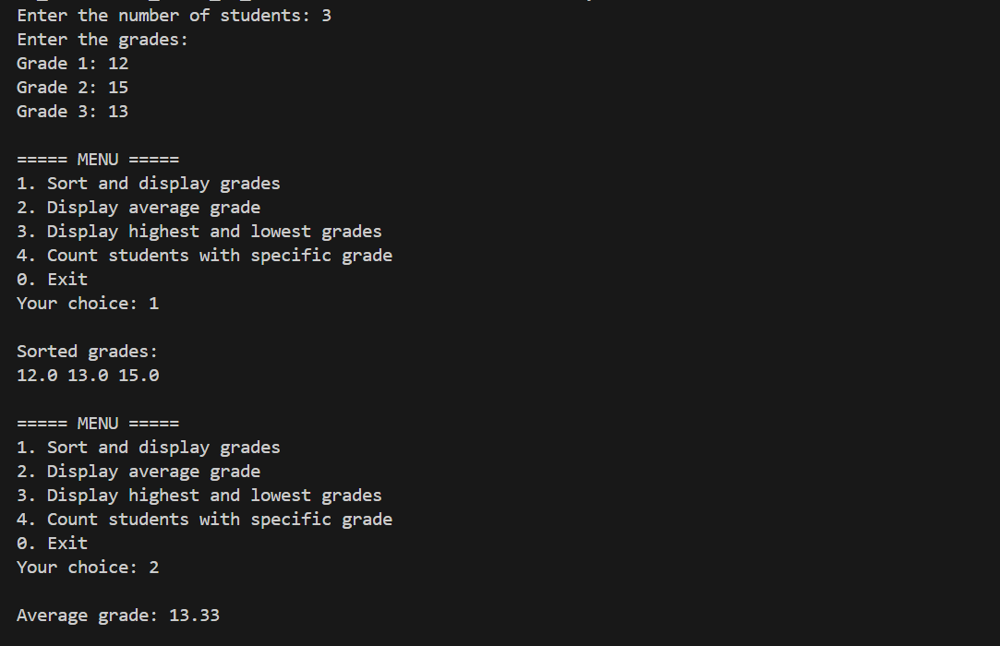
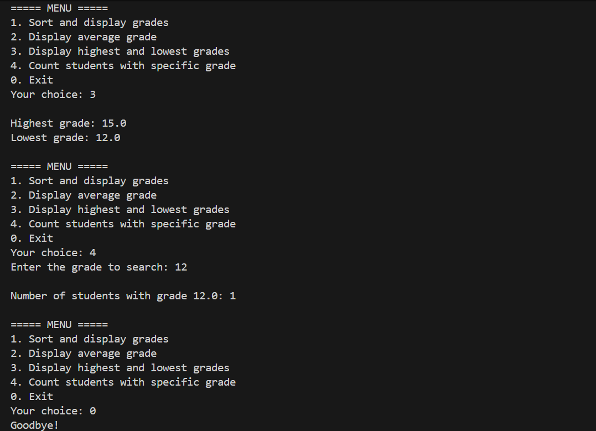
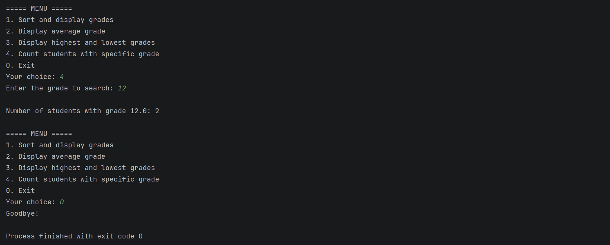
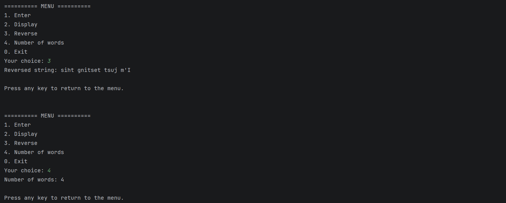

# JAVA_ENSET_TP

## Table of Contents

* [Exercise 1: Student Grade Management](#exercise-1-student-grade-management)
* [Exercise 2: Verb Conjugation](#exercise-2-verb-conjugation)
* [Exercise 3: String Manipulation Menu](#exercise-3-string-manipulation-menu)
* [Exercise 4: Letter Occurrence Counter](#exercise-4-letter-occurrence-counter)

---

## Exercise 1: Student Grade Management

### Problem Description

This program manages student grades. It allows the user to enter a specific number of students and their corresponding grades. Then, it presents an interactive menu with the following options:

1. Sort and display the grades.
2. Display the class average.
3. Display the highest and lowest grades.
4. Count how many students obtained a specific grade.
The program runs in a loop until the user chooses to exit.

### Solution

```java
package TP1;

import java.util.Arrays;
import java.util.Scanner;

public class Exercise1 {
    public static void main(String[] args) {
        Scanner scanner = new Scanner(System.in);

        // 1. Get the number of students
        System.out.print("Enter the number of students: ");
        int n = scanner.nextInt();

        // 2. Initialize array and get grades
        double[] grades = new double[n];
        System.out.println("Enter the grades:");
        for (int i = 0; i < n; i++) {
            System.out.print("Grade for student " + (i + 1) + ": ");
            grades[i] = scanner.nextDouble();
        }

        // 3. Menu Loop
        int choice;
        do {
            System.out.println("\n===== GRADE MANAGER =====");
            System.out.println("1. Sort and display grades");
            System.out.println("2. Display average grade");
            System.out.println("3. Display Min and Max grades");
            System.out.println("4. Count students with specific grade");
            System.out.println("0. Exit");
            System.out.print("Your choice: ");
            choice = scanner.nextInt();

            switch (choice) {
                case 1:
                    sortAndDisplay(grades);
                    break;
                case 2:
                    displayAverage(grades);
                    break;
                case 3:
                    displayMinMax(grades);
                    break;
                case 4:
                    System.out.print("Enter the grade to search for: ");
                    double searchGrade = scanner.nextDouble();
                    countGrade(grades, searchGrade);
                    break;
                case 0:
                    System.out.println("Exiting application. Goodbye!");
                    break;
                default:
                    System.out.println("Invalid choice! Please try again.");
            }
        } while (choice != 0);

        scanner.close();
    }

    // Sorts the array and prints it without modifying the original order permanently
    public static void sortAndDisplay(double[] grades) {
        double[] sortedGrades = grades.clone(); // Clone to keep original array intact
        Arrays.sort(sortedGrades);
        System.out.println("\nSorted grades:");
        for (double grade : sortedGrades) {
            System.out.print(grade + " | ");
        }
        System.out.println();
    }

    // Calculates and prints the average
    public static void displayAverage(double[] grades) {
        double sum = 0;
        for (double grade : grades) {
            sum += grade;
        }
        double average = sum / grades.length;
        System.out.printf("\nClass Average: %.2f\n", average);
    }

    // Finds Min and Max values
    public static void displayMinMax(double[] grades) {
        double min = grades[0];
        double max = grades[0];

        for (double grade : grades) {
            if (grade < min) min = grade;
            if (grade > max) max = grade;
        }

        System.out.println("\nHighest grade: " + max);
        System.out.println("Lowest grade: " + min);
    }

    // Counts occurrences of a specific grade
    public static void countGrade(double[] grades, double searchGrade) {
        int count = 0;
        for (double grade : grades) {
            if (grade == searchGrade) {
                count++;
            }
        }
        System.out.println("\nThere are " + count + " student(s) with the grade " + searchGrade);
    }
}

```

### How to Solve

1. **Input Phase**: Use `Scanner` to ask for the size of the array (`n`), then loop `n` times to fill the `double[]` array with grades.
2. **Menu Loop**: Use a `do-while` loop to keep the program running. Inside, display options and capture the user's `choice`.
3. **Modular Logic**: Break down each task into a separate method (`static void`) to keep the `main` method clean:
* **Sort**: Use `Arrays.sort()` on a copy (`clone()`) of the array so we don't lose the original input order.
* **Average**: Sum all elements in a loop and divide by `.length`.
* **Min/Max**: Initialize min/max with the first element, then loop through the rest to compare.
### Program Execution






---

## Exercise 2: Verb Conjugation

### Problem Description

This program conjugates regular first-group French verbs (those ending in "er"). The user inputs a verb, and the program validates it. If valid, it displays the conjugation for all pronouns. It also handles the exception for the verb "aller".

### Solution

```java
package TP1;

import java.util.Scanner;

public class Exercise2 {
    public static void main(String[] args) {
        Scanner input = new Scanner(System.in);

        System.out.print("Entrez un verbe du premier groupe (ex: parler): ");
        String verb = input.nextLine().toLowerCase().trim();

        // Validation: must end in "er" and not be "aller" (which is 3rd group)
        if (verb.equals("aller")) {
            System.out.println("Attention : 'aller' est un verbe du 3ème groupe !");
        } else if (verb.length() < 3 || !verb.endsWith("er")) {
            System.out.println("Erreur : Ce n'est pas un verbe régulier du 1er groupe.");
        } else {
            // Logic: remove "er" to get radical, then add endings
            String radical = verb.substring(0, verb.length() - 2);

            System.out.println("\nConjugaison du verbe " + verb.toUpperCase() + " :");
            System.out.println("je " + radical + "e");
            System.out.println("tu " + radical + "es");
            System.out.println("il/elle " + radical + "e");
            System.out.println("nous " + radical + "ons");
            System.out.println("vous " + radical + "ez");
            System.out.println("ils/elles " + radical + "ent");
        }

        input.close();
    }
}

```

### How to Solve

1. **Input**: Get the string and normalize it (trim spaces, convert to lowercase).
2. **Validation**:
* Check if it is "aller" (irregular verb exception).
* Check if it ends with "er".
* Check length to avoid index errors on very short strings.


3. **Processing**: Use `substring(0, length-2)` to isolate the "radical" (the root of the verb).
4. **Output**: Concatenate the radical with the standard French endings: *-e, -es, -e, -ons, -ez, -ent*.

### Program Execution


---

## Exercise 3: String Manipulation Menu

### Problem Description

This program offers a menu to perform operations on a string. The user must first enter a string. Once entered, they can display it, reverse it, or count the words in it. The program handles input buffers correctly to avoid skipping text entry.

### Solution

```java
package TP1;

import java.util.Scanner;

public class Exercise3 {
    public static void main(String[] args) {
        Scanner input = new Scanner(System.in);
        String text = "";
        int choice;

        do {
            System.out.println("\n========== STRING MENU ==========");
            System.out.println("1. Enter a string");
            System.out.println("2. Display the string");
            System.out.println("3. Reverse the string");
            System.out.println("4. Count number of words");
            System.out.println("0. Exit");
            System.out.print("Your choice: ");
            
            choice = input.nextInt();
            input.nextLine(); // Important: Consume the leftover newline character

            switch (choice) {
                case 1:
                    System.out.print("Enter your text: ");
                    text = input.nextLine();
                    System.out.println("String saved!");
                    waitForKey(input);
                    break;

                case 2:
                    if (checkIfEmpty(text)) {
                        System.out.println("Current string: " + text);
                    }
                    waitForKey(input);
                    break;

                case 3:
                    if (checkIfEmpty(text)) {
                        String reversed = reverseString(text);
                        System.out.println("Reversed: " + reversed);
                    }
                    waitForKey(input);
                    break;

                case 4:
                    if (checkIfEmpty(text)) {
                        int count = countWords(text);
                        System.out.println("Word count: " + count);
                    }
                    waitForKey(input);
                    break;

                case 0:
                    System.out.println("Goodbye!");
                    break;

                default:
                    System.out.println("Invalid option.");
                    waitForKey(input);
            }
        } while (choice != 0);

        input.close();
    }

    // Helper to reverse string manually
    public static String reverseString(String str) {
        String res = "";
        for (int i = str.length() - 1; i >= 0; i--) {
            res += str.charAt(i);
        }
        return res;
    }

    // Helper to count words manually
    public static int countWords(String str) {
        str = str.trim(); // remove leading/trailing spaces
        if (str.isEmpty()) return 0;

        int count = 0;
        boolean isWord = false; // State variable

        for (int i = 0; i < str.length(); i++) {
            if (str.charAt(i) != ' ' && !isWord) {
                isWord = true;
                count++;
            } else if (str.charAt(i) == ' ') {
                isWord = false;
            }
        }
        return count;
    }

    // Simple validation helper
    public static boolean checkIfEmpty(String text) {
        if (text == null || text.isEmpty()) {
            System.out.println("Please enter a string first (Option 1).");
            return false;
        }
        return true;
    }

    // Helper to pause execution
    public static void waitForKey(Scanner input) {
        System.out.println("\nPress Enter to continue...");
        input.nextLine();
    }
}

```

### How to Solve

1. **Structure**: A `do-while` loop drives the menu.
2. **Scanner Fix**: After reading the `int` for the menu choice, use `input.nextLine()` immediately to consume the "Enter" key code. This prevents the program from skipping the input in Case 1.
3. **Reverse Logic**: Create an empty string `res`. Loop through the original string from the *last* index (`length-1`) down to `0`, adding characters to `res`.
4. **Word Count Logic**:
* First, `trim()` the string to ignore spaces at the start/end.
* Loop through characters. If we find a non-space character and we were *not* currently inside a word, increment the counter and mark `isWord = true`. If we hit a space, mark `isWord = false`. This handles multiple spaces between words correctly.


### Program Execution





---

## Exercise 4: Letter Occurrence Counter

### Problem Description

This program performs a frequency analysis of letters in a text. The user enters a line of text, and the program counts how many times each letter (A-Z) appears, ignoring case (e.g., 'a' and 'A' count as the same letter).

### Solution

```java
package TP1;

import java.util.Scanner;

public class Exercise4 {
    public static void main(String[] args) {
        Scanner input = new Scanner(System.in);

        System.out.print("Enter a line of text: ");
        String text = input.nextLine();

        // Convert to Uppercase to make counting case-insensitive
        text = text.toUpperCase();

        System.out.println("\nCharacter frequency:");
        
        // Loop through every letter from A to Z
        for (char letter = 'A'; letter <= 'Z'; letter++) {
            int count = 0;

            // Inner loop: Check the whole string for the current 'letter'
            for (int i = 0; i < text.length(); i++) {
                if (text.charAt(i) == letter) {
                    count++;
                }
            }

            // Only print if the letter actually exists in the text
            if (count > 0) {
                System.out.println(count + " x " + letter);
            }
        }

        input.close();
    }
}

```

### How to Solve

1. **Input & Normalization**: Read the text and use `.toUpperCase()` so we don't have to check for 'a' and 'A' separately.
2. **Outer Loop (The Alphabet)**: Use a `for` loop with a `char` iterator starting at `'A'` and ending at `'Z'`.
3. **Inner Loop (The Counter)**: For every letter in the alphabet loop, scan the entire input string. If `text.charAt(i)` matches the current alphabet letter, increment `count`.
4. **Display**: If `count > 0` after scanning the string, print the result. This ensures we don't print "0 x Z" if there is no Z.

### Program Execution

